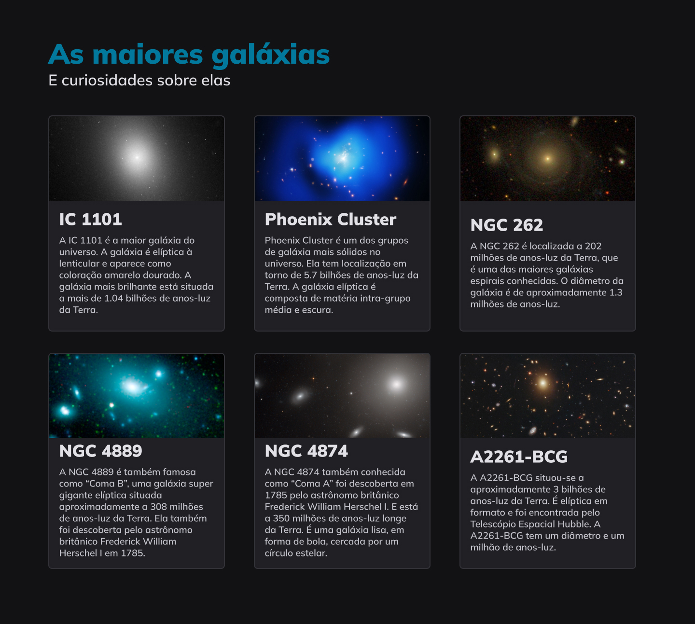

<h1 align="center"> Galaxies </h1>

As maiores galáxias e curiosidades sobre elas. 

 

  

## Tecnologias

Esse projeto foi desenvolvido com as seguintes tecnologias:

- HTML e CSS
- JavaScript
- Git e Github
- Figma

## Aprendizados

- Grid e Flex
- Display
- Row e Columns
- Grid tamplate

